# CSS3 RoadMap

Learning Resources
- [CSS Tips and Tricks](https://markodenic.com/css-tips/)
- [CheatSheet](https://devhints.io/css)

Indexes
- [All projects Live Preview](https://roopaish.github.io/CSS-RoadMap/)
- [Contents](#Contents)
- [Projects](#Projects)

## Contents

1. Selectors

```css
- element, .class-name, #id, element.className

- [aria-hidden="true"] (selects elements with aria-hidden attribute with value true),

- div.row * (all child elements of div of class row)

- li > a (Only direct descendants, not all)

- li + a (Only the first a after each li)

- li, a (All a elements and all li elements)

- li ~ a (a element following a li element)
```

2. Cascading and Inheritance

```css
- Last property is used for same element
- id > className > element
- inherit (Inherit parents property)
- initial (Sets to initial value of that property)
- unset (Resets the property to its natural value)
```

3. Box Model

```css
- content, padding, border, margin
```

4. Position

```css
- position: relative | absolute | fixed | sticky;
- top, right, bottom, left
```

5. Display

```css
- display: block | inline-block | inline | table | flex | grid;
```

6. Flexbox

```css
display: flex;
flex-direction: row | column;
flex-wrap: wrap | nowrap | wrap-reverse;
justify-content: flex-start | flex-end | center | space-around | space-between |
  space-evenly;
align-items: flex-start | flex-end | center | space-around | space-between |
  space-evenly;
```

7. Grid

```css
display: grid;
grid-template-columns: repeat(12, 1fr);
grid-auto-rows: 120px;
gap: 10px;
column-gap: 10px;
row-gap: 10px;
```

8. Float

```css
float: left | right;
```

9. Calc

```css
width: calc(100%-20px);
```

10. Pseudo Elements

```css
- p::first-line, p::first-letter
- p::after, p::before
- ::marker(marker of all lists)
- ::selection: color, background, cursor, and outline (on selecting text)
```

11. Pseudo Classes

```css
-	a:active	(Selects the active link)
-	a:hover	(Selects links on mouse over)
-	a:link	(Selects all unvisited links)
-	a:visited	(Selects all visited links)

-	input:checked	(Selects every checked <input> element)
-	input:focus	(Selects the <input> element that has focus)
-	input:disabled	(Selects every disabled <input> element)
-	input:enabled	(Selects every enabled <input> element)

-	input:in-range	(Selects <input> elements with a value within a specified range)
-	input:out-of-range	(Selects <input> elements with a value outside a specified range)
-	input:valid	(Selects all <input> elements with a valid value)
-	input:invalid	(Selects all <input> elements with an invalid value)
-	input:optional	(Selects <input> elements with no "required" attribute)

-	input:read-only	(Selects <input> elements with a "readonly" attribute specified)
-	input:read-write	(Selects <input> elements with no "readonly" attribute)
-	input:required	(Selects <input> elements with a "required" attribute specified)

-	p:empty	(Selects every <p> element that has no children)
-	p:first-child	(Selects every <p> elements that is the first child of its parent)
-	p:first-of-type	(Selects every <p> element that is the first <p> element of its parent)

-	p:last-child	(Selects every <p> elements that is the last child of its parent)
-	p:last-of-type	(Selects every <p> element that is the last <p> element of its parent)

-	p:lang(it)	(Selects every <p> element with a lang attribute value starting with "it")

-	:not(p)	(Selects every element that is not a <p> element)

-	p:nth-child(2)	(Selects every <p> element that is the second child of its parent)
-	p:nth-last-child(2)	(Selects every <p> element that is the second child of its parent, counting from the last child)
-	p:nth-last-of-type(2)	(Selects every <p> element that is the second <p> element of its parent, counting from the last child)
-	p:nth-of-type(2)	(Selects every <p> element that is the second <p> element of its parent)

-	a:nth-childe(odd) (Selects all odd elements of a given type)
-	a:nth-childe(even) (Selects all even elements of a given type)
-	a:nth-childe(3n)  (Selects every 3rd anchor element)

-	p:only-of-type	(Selects every <p> element that is the only <p> element of its parent)
-	(p:only-child	Selects every <p> element that is the only child of its parent)


-	:root	(Selects the document's root element)
-	#news:target	(Selects the current active #news element )

```

12. Custom Properties

```css
-CSS variables :root {
  --background: "red";
}
element {
  --main-bg-color: brown;
}

p {
  background-color: var(--background);
}
```

13. Media Queries

```css
@media (min-width: 600px) {
  html {
    font-size: 1.2px;
  }
}

@media not|only mediatype and (expressions) {
  CSS-Code;
}

- meidatypes = all | screen | print | speech | orientation

/* When the width is between 600px and 900px OR above 1100px - change the appearance of <div> */
@media screen and (max-width: 900px) and (min-width: 600px), (min-width: 1100px) {}
```

14. Animations

```css
transition: 0.2s ease-in-out alternate;
animation: animationName 0.2s linear infinite;

@keyframe animationName {
  to {
  }
  from {
  }
}
@keyframe animationName {
  0% {
  }
  50% {
  }
  100% {
  }
}
```

### Projects

1. Easy

   - Transparent Login Form [preview](https://roopaish.github.io/CSS-RoadMap/Transparent%20Login%20Form) [code](https://github.com/Roopaish/CSS-RoadMap/tree/master/Transparent%20Login%20Form)
     <br>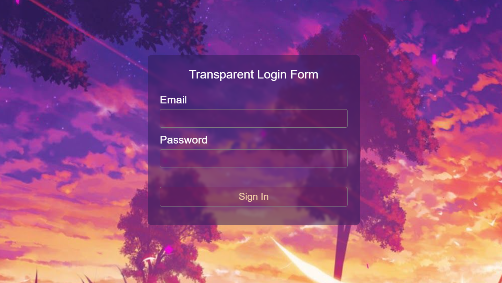<br><br>
   - Responsive Video Background [preview](https://roopaish.github.io/CSS-RoadMap/Responsive%20Video%20Background) [code](https://github.com/Roopaish/CSS-RoadMap/tree/master/Responsive%20Video%20Background)
     <br> 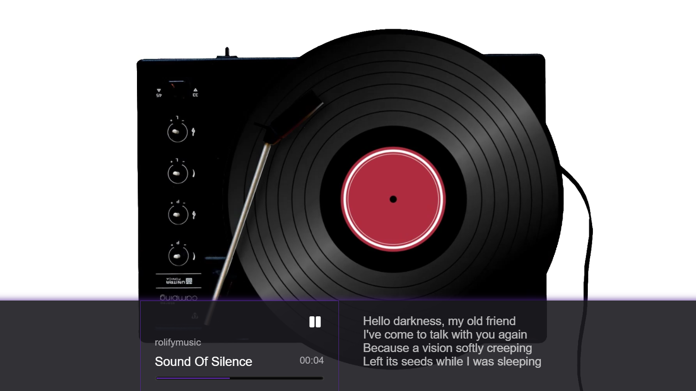<br><br>

2. Medium

   - CSS Only Tooltips [preview](https://roopaish.github.io/CSS-RoadMap/CSS%20Only%20Tooltips/) [code](https://github.com/Roopaish/CSS-RoadMap/tree/master/CSS%20Only%20Tooltips/)
     <br> 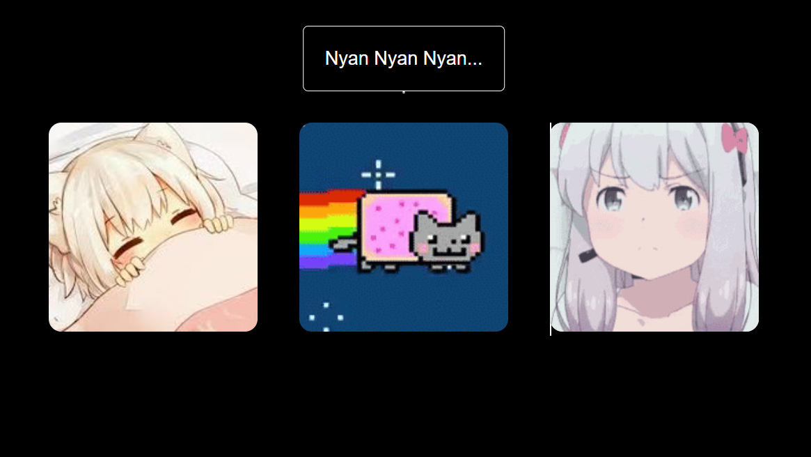<br><br>
   - CSS Emoji Art [preview](https://roopaish.github.io/CSS-RoadMap/CSS%20Only%20Emoji%20Art/) [code](https://github.com/Roopaish/CSS-RoadMap/tree/master/CSS%20Only%20Emoji%20Art)
     <br> 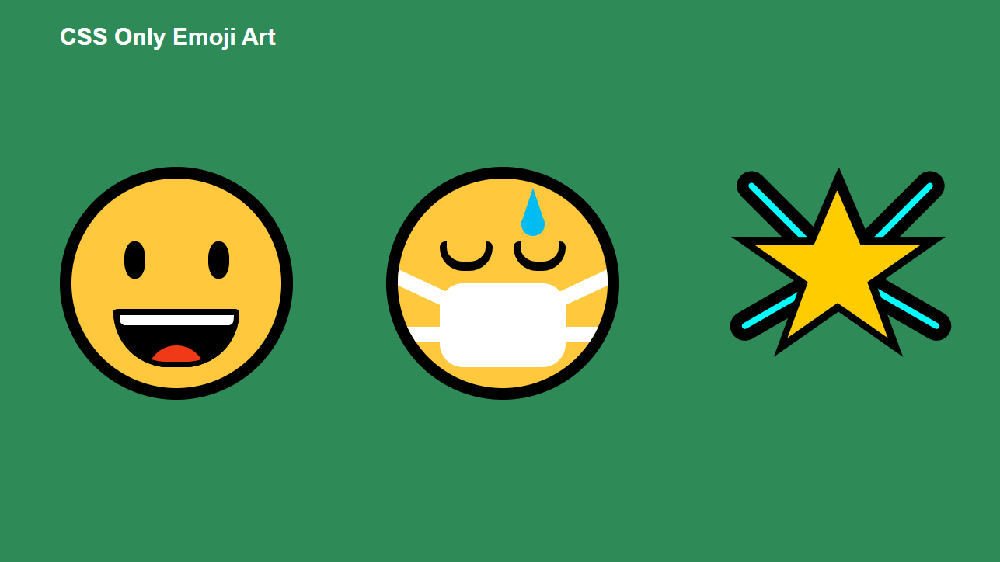<br><br>
   - CSS Face Art [preview](https://roopaish.github.io/CSS-RoadMap/CSS%20Face%20Art/) [code](https://github.com/Roopaish/CSS-RoadMap/tree/master/CSS%20Face%20Art/)
     <br> 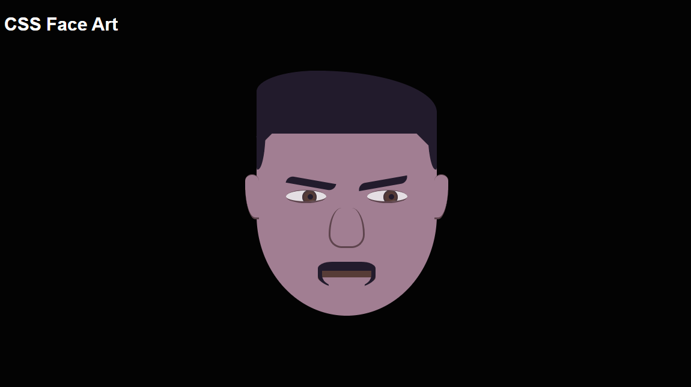<br><br>
   - Advanced Hover Effects [preview](https://roopaish.github.io/CSS-RoadMap/Advanced%20Hover%20Effects/) [code](https://github.com/Roopaish/CSS-RoadMap/tree/master/Advanced%20Hover%20Effects/)
     <br> 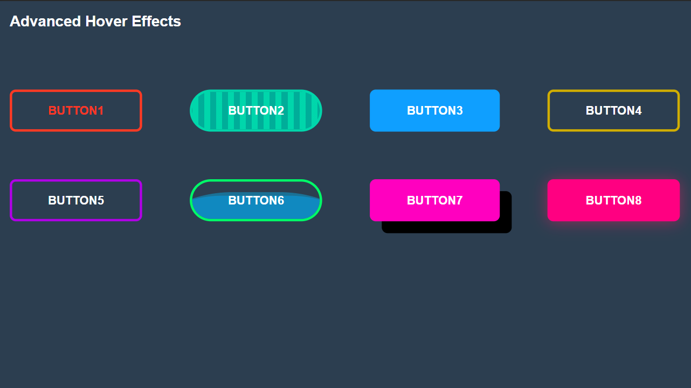<br><br>
   - Animated Page Load [preview](https://roopaish.github.io/CSS-RoadMap/Animated%20Page%20Load/) [code](https://github.com/Roopaish/CSS-RoadMap/tree/master/Animated%20Page%20Load/)
     <br> 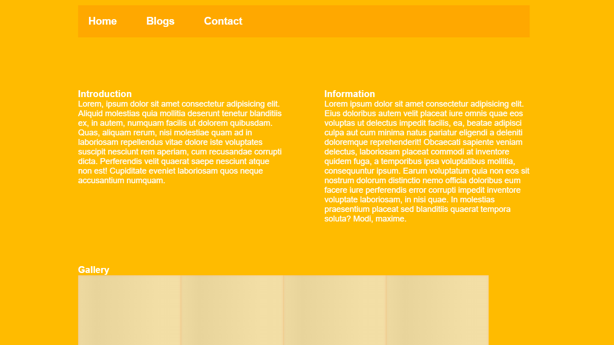<br><br>
   - Custom Checkbox and Radio [preview](https://roopaish.github.io/CSS-RoadMap/Custom%20Checkbox%20and%20Radio/) [code](https://github.com/Roopaish/CSS-RoadMap/tree/master/Custom%20Checkbox%20and%20Radio/)
     <br> 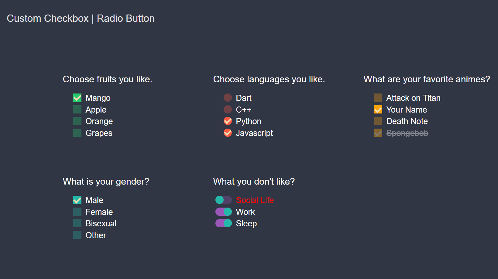<br><br>
   - 3D Flip Button [preview](https://roopaish.github.io/CSS-RoadMap/3D%20Flip%20Button/) [code](https://github.com/Roopaish/CSS-RoadMap/tree/master/3D%20Flip%20Button/)
     <br> 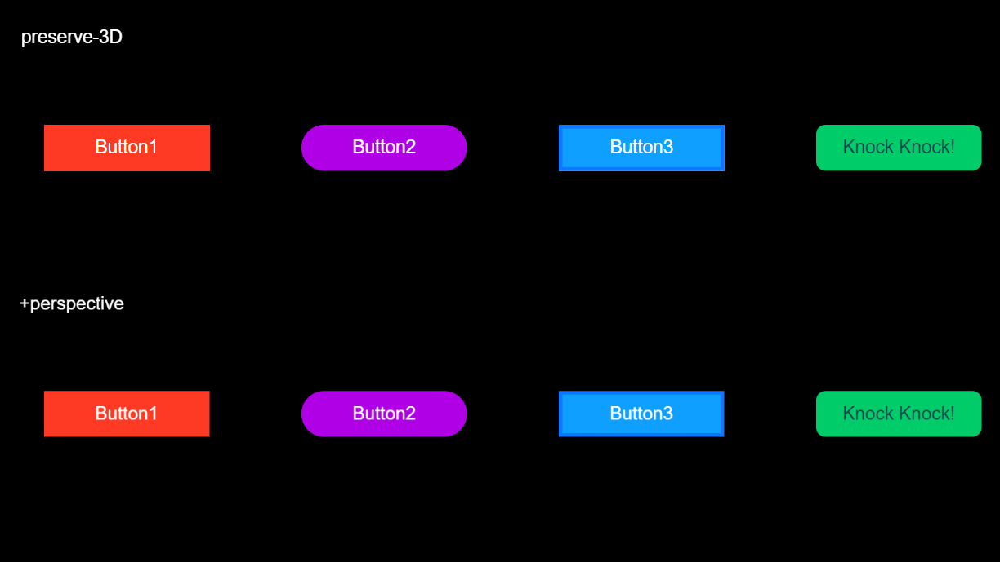<br><br>
   - Animated Loading Spinner [preview](https://roopaish.github.io/CSS-RoadMap/Animated%20Preloaders/) [code](https://github.com/Roopaish/CSS-RoadMap/tree/master/Animated%20Preloaders/)
     <br> 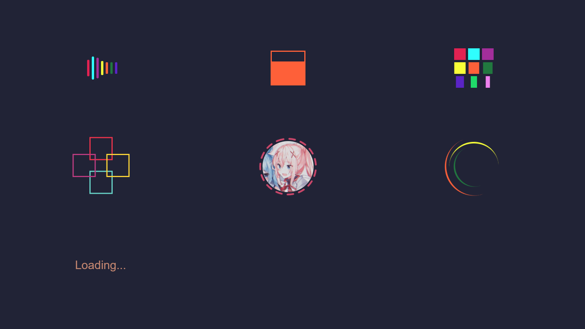<br><br>

3. Hard

   - YouTube Clone [preview](https://roopaish.github.io/CSS-RoadMap/Youtube%20Clone%20-%20Redesign/) [code](https://github.com/Roopaish/CSS-RoadMap/tree/master/Youtube%20Clone%20-%20Redesign/)
     <br> 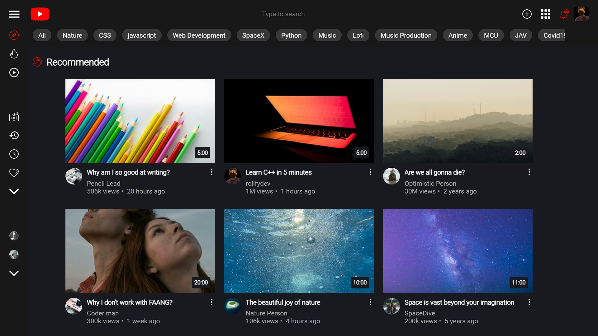<br><br>
   - Godot Landing Page [preview](https://roopaish.github.io/CSS-RoadMap/Godot%20Landing%20Page%20-%20Redesign) [code](https://github.com/Roopaish/CSS-RoadMap/tree/master/Godot%20Landing%20Page%20-%20Redesign)
     <br> 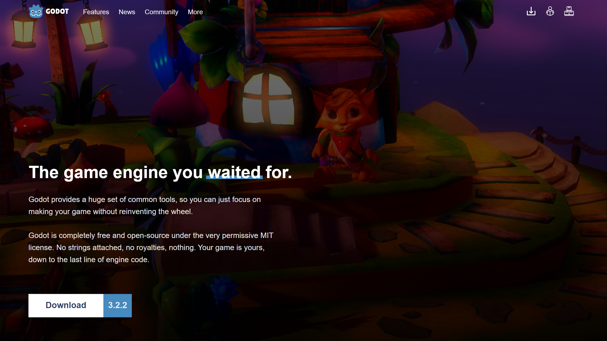<br><br>
